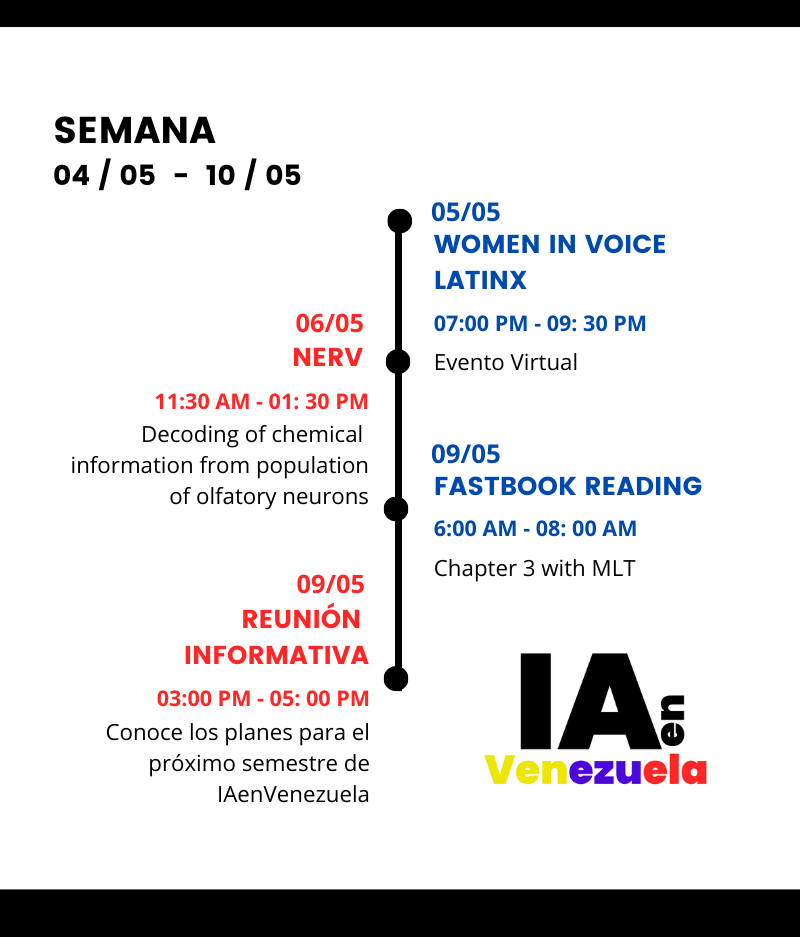

# Semana 04/05 - 10/05

¡Hola!

Semana a semana les recomendaremos actividades y webinars de machine learning. Los de ésta semana son los siguientes:

### Martes 05/05

**Women in Voice Latinx Webinar.** 

07:00pm - 09:00pm GMT-4

Registro en: [https://t.co/RSdvMFZJXS?amp=1](https://t.co/RSdvMFZJXS?amp=1)

Organizadores: [https://twitter.com/womeninvoicelat](https://twitter.com/womeninvoicelat)

### Miércoles 06/05

**Nerv Webinar.** 

Decoding of chemical information from populations of olfactory neurons - Pedro Herrero-Vidal NYU.

11:30am-01:30pm Hora Venezuela (GMT-4)

Registro en: [https://www.crowdcast.io/e/nervevent-pedro/register](https://www.crowdcast.io/e/nervevent-pedro/register)

### Sábado 09/05

**Fastbook Reading Session (Chapter 3). Machine Learning Tokio** 

06:00am - 08:00am GMT-4 Chapter 3. 

Fastbook: [https://github.com/fastai/fastbook](https://github.com/fastai/fastbook)

**Reunión Informativa Proyecto IA en Venezuela**

03:00-05:00pm GMT-4

Nuestra primera reunión informativa para dar a conocer los detalles de la organización y futuros proyectos.

Unirse a través de Zoom:

[https://ucab.zoom.us/j/98753231798](https://ucab.zoom.us/j/98753231798)

Meeting ID: **987 5323 1798**

Password: **6g?0pEiE**
